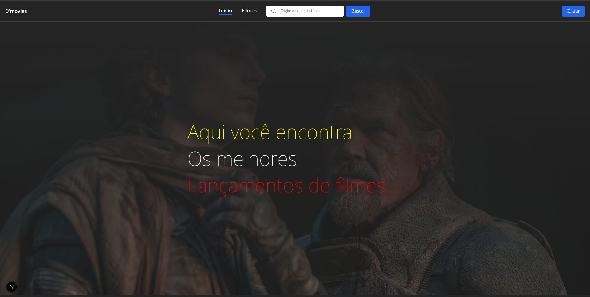
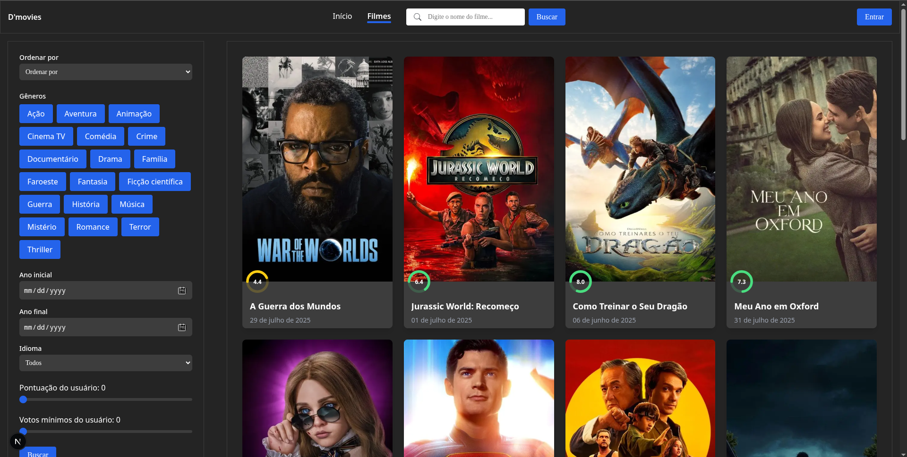
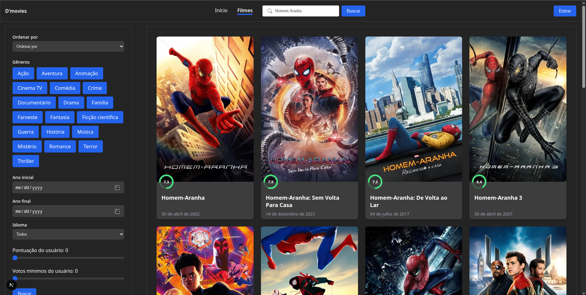
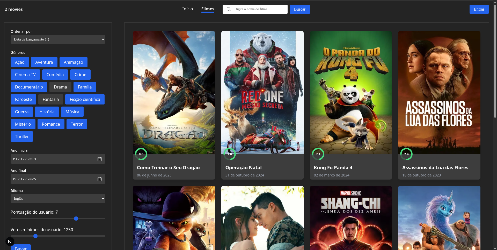
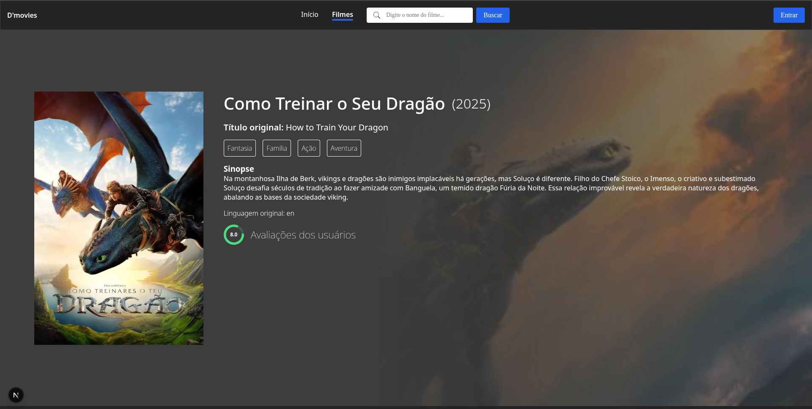

## 🎬 D’movies - Frontend

Interface moderna e 100% responsiva para busca, listagem e visualização de informações detalhadas sobre filmes.  
Desenvolvida com **Next.js 15**, **SASS** e arquitetura modular, conectada ao backend próprio para garantir desempenho e evitar requisições desnecessárias à API externa.

---

### 🚀 Tecnologias Utilizadas
- **Next.js 15** – Server & Client Components
- **SASS** – arquitetura modular e responsiva
- **TypeScript** – tipagem estática e segura
- **Fetch API nativa** – consumo otimizado do backend
- **Arquitetura Mobile First** – adaptada para qualquer tela

---

### 📸 Prévia

**Tela principal**  


**Tela principal de filmes**  


**Tela principal dos filmes com busca ativada**  


**Filtro avançado funcionando**  


**Tela de detalhes do filme**  


---

### 📂 Estrutura de Pastas

src/  
├── app/ # Rotas e páginas do Next.js  
├── components/ # Componentes reutilizáveis (UI e lógicos)  
├── context/ # Context API para estados globais  
├── hooks/ # Hooks customizados  
├── styles/ # Estilos SASS organizados por módulo  
├── types/ # Tipagens TypeScript globais  
└── utils/ # Funções utilitárias e helpers  

---

### ⚙️ Funcionalidades
- 🔍 **Busca inteligente** de filmes por nome
- 🎯 **Filtros avançados** (gênero, idioma, ano, avaliação e votos)
- 📄 **Paginação dinâmica** com atualização sem recarregar a página
- 🖼️ **Detalhes completos** de cada filme com título, sinopse, gêneros e notas
- 📱 **Design adaptável** do mobile ao desktop
- 🔄 **Comunicação otimizada** com o backend para reduzir chamadas desnecessárias

---

### 📦 Instalação
```bash
# Clonar repositório
git clone https://github.com/rodrilucas/d-movies-frontend.git

# Entrar na pasta do projeto
cd d-movies-frontend

# Instalar dependências
npm install

# Executar em modo desenvolvimento
npm run dev
```

## 🔗 Backend
Este frontend consome a API do **D’movies Backend**.  
➡️ **Repositório:** [D-movies Backend](https://github.com/rodrilucas/d-movies-backend)

---

**Créditos:** Este projeto utiliza dados e imagens fornecidos pelo [The Movie Database (TMDB)](https://www.themoviedb.org/).  

## 📄 Licença
MIT License © Lucas

---


